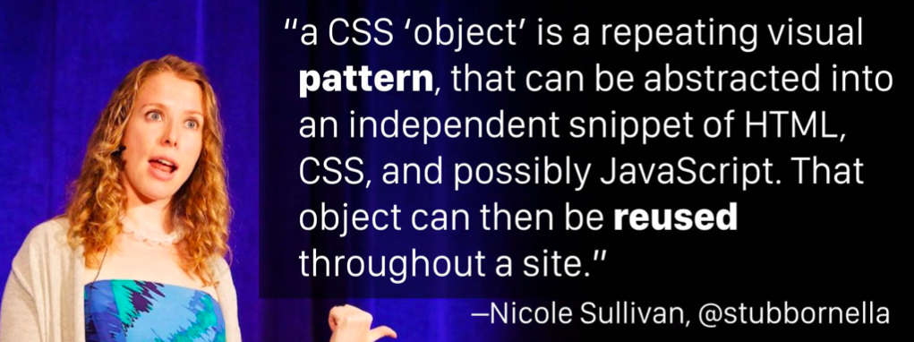

# Block, element and modifier (BEM)

[https://en.bem.info/methodology/](https://en.bem.info/methodology/)

That brings us to the next big framework to help define the Modular CSS ethos. BEM, which stands for Block, Element, Modifier, was also created in 2009. It was developed at Yandex, which is like the Russian version of Google. They also operate a search engine and webmail program, so they were solving the same scale-related problems as Yahoo at the same time.

 