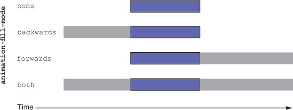

# Animation properties

<style>
    @keyframes over-and-back {         
        0% {
            background-color: hsl(0, 50%, 50%);
            transform: translate(0, 0);           
        }

        20% {                                
            transform: translate(200px, 100px);
        }

        50% {                                   
            background-color: hsl(270, 50%, 90%);  
            transform: translate(400px, 0);               
        }
        
        75% {                                   
            background-color: hsl(0, 50%, 50%);  
            transform: translate(200, 100px);               
        }

        100% {
            background-color: hsl(270, 50%, 90%);  
            transform: translate(0, 0);  
        }
    }

    .box {
        width: 100px;                             
        height: 100px;                            
        background-color: green;
        animation: over-and-back 3s linear infinite;
    }
</style>

<div style="height: 250px">
    <div class="box"></div>
</div>

---

You can use:
* `animation-name` — Indicates the name of the animation as defined by the @keyframes rule.
* `animation-duration` (1.5s) — Indicates how long the animation lasts; in this case, 1.5 seconds.
* `animation-timing-function` (linear) — Indicates a timing function describing how the animation accelerates and/or decelerates. This can be a Bézier curve or a keyword value, like a transition timing function (ease-in, ease-out, and so on).
* `animation-iteration-count` (3) — Indicates the number of times the animation repeats. If omitted, the initial value of 1 is used.
* `animation-delay` (0.5s) - Indicates for how long animation should be delayed for concrete item.
* `animation-fill-mode` - To apply animation styles before or after the animation plays. By default is none, but can be **backwards**, **forwards**, **both**

Separate discussion must be done for `animation-fill-mode`:



The initial value of animation-fill-mode is none, which means the animation styles are not applied to the element before or after the animation. By applying animation-fill-mode: backwards, the browser takes the values from the first frame of the animation and applies them to the element before the animation is played. Using forwards continues to apply the last frame values after the animation completes. Using both fills both backward and forward.
  
Or just shorthand `animation` property.

Together with animation property you need to define keyframes by using - `@keyframe`

```css
@keyframes over-and-back {         
    0% {
        background-color: hsl(0, 50%, 50%);
        transform: translate(0);           
    }

    50% {                                
        transform: translate(200px);
    }

    100% {                                   
        background-color: hsl(270, 50%, 90%);  
        transform: translate(0);               
    }                                        
}

.box {
    width: 100px;                             
    height: 100px;                            
    background-color: green;
    animation: over-and-back 1.5s linear infinite;
}
```