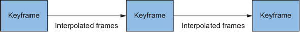

# Keyframe

*A transition is conceptually similar to a keyframe animation: You define the first frame (starting point) and the last (ending point), and the browser computes all the intermediate values so the element can transition smoothly between them. With keyframe animation, however, you’re not limited to defining only two points. You can define as many as you like. The browser fills in the values from one to the next to the next, until it reaches the final keyframe, producing a series of seamless transitions.*

    

